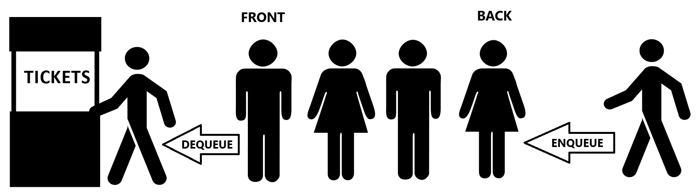
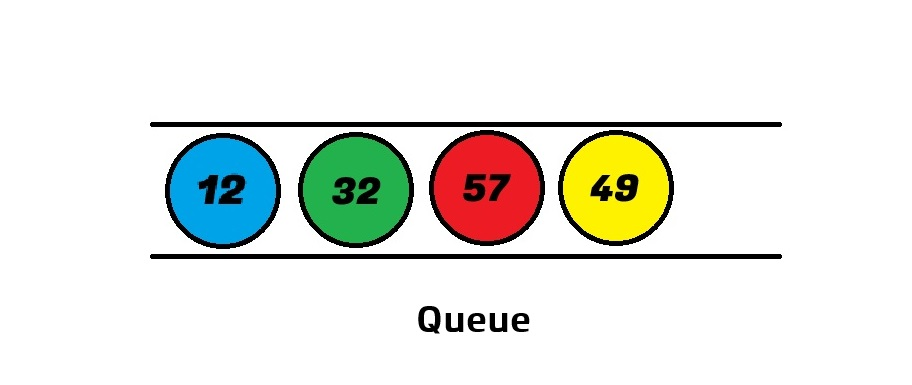
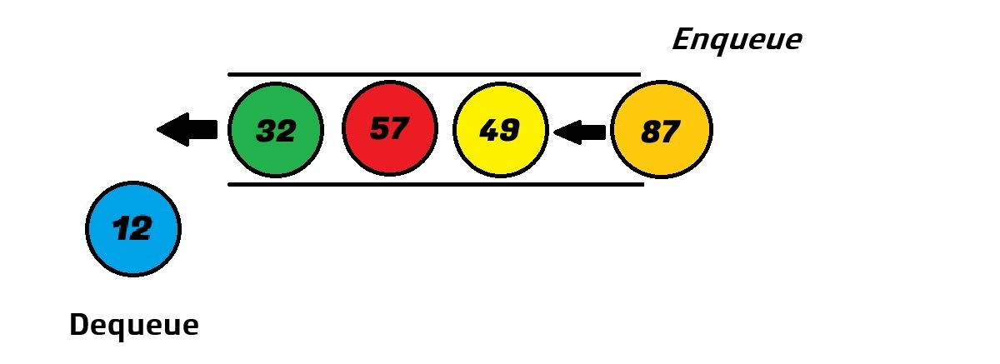
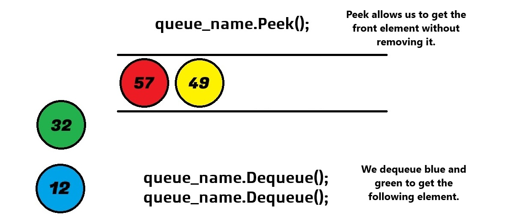
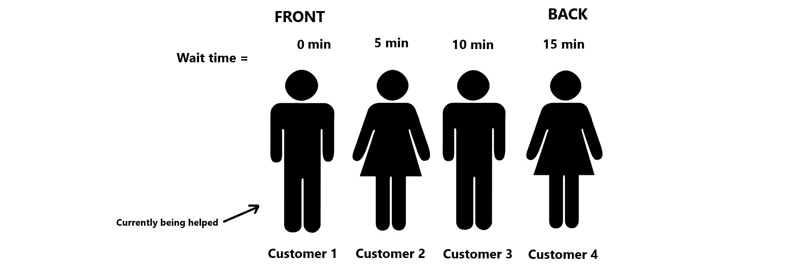
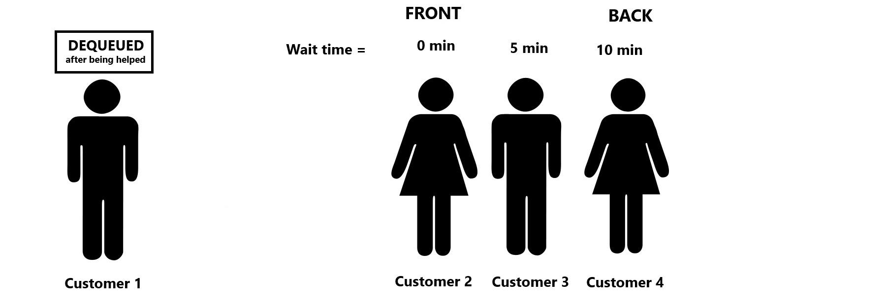

[Back to Welcome Page](/0-welcome.md)
# Queue 

A queue is a data structure that mimics certain characteristics of a queue or a line in real life, like a line for a movie ticket or a line at the grocery store.

The queue data structure is a linear collection of data that is ordered and follows the First In, First Out (FIFO) principle. This means that data is processed in the exact order it is input. If the data value 3 was input into a queue first and then the data value 10 was input to the queue after 3, the data would be in order of 3, 10, because 3 was input first before 10. A queue data structure does not allow us to insert or enter data in the middle of the queue, just like someone can't cut the line (or at least they shouldn't).



## Queue Terminology
- **Queue** - a data structure that follows the First In, First Out (FIFO) principle. A queue is used to maintain and remember the order of the data.  
- **Front** - refers to the location where a dequeue occurs. It is the item that was first added to the queue.  
- **Back** - refers to the location where the enqueue occurs. It is the last item added to the queue.  
- **Enqueue** - the operation used to add an item to the queue. It always adds items to the back of the queue.  
- **Dequeue** - the operation used to remove an item from the queue. It always removes items from the front of the queue.  
- **Peek** - the operation used to check the front item without dequeuing or removing it from the queue.  
- **Size** - the operation used to check the size of the queue.  
- **Empty** - the operation used to see if the queue is empty.


Another way to think of a queue is like marbles in a tube. Imagine you have a blue marble with value 12, a green marble with value 32, a red marble with value 57 and a yellow marble with value 49. Both ends of the tube are open and we can see the marbles are in order. 

<br>

The blue marble is the **front** and the yellow marble is at the **back** of the. If we want to get or remove the blue marble and its value which are at the front of the queue we use the **dequeue** operation. When a new marble is added to the back of the queue, we use the **enqueue** operation. 

<br>

If we want to get the red marble and its value 57, we have to use the dequeue operation twice, to dequeue the blue marble and the green marble. Then we can use the **peek** operation to get the front element without removing it. 

<br>

In addition to enqueue, dequeue and peek, we can also check a queue size and if a queue is empty. 

## Operations & Performance

| Operation | Description                                       | C# Code                                    | Performance |
|-----------------|---------------------------------------------------|--------------------------------------------|-------------|
| enqueue(value) | Adds a value to the back of the queue            | queue_name.Enqueue(value);                 | O(1)        |
| dequeue()       | Removes items from the front of the queue        | var item = queue_name.Dequeue();           | O(1)        |
| peek()          | Gets the front element without removing it       | var item = queue_name.Peek();              | O(1)        |
| size()          | Checks the total number of elements in the queue       | int count = queue_name.Count;              | O(1)        |
| empty()         | Returns true if the queue is  empty | if (queue_name.Count == 0) {.........} | O(1)        |

### enqueue(value):
- Adds an element to the back of the queue.
```csharp
Queue<int> queue_name = new Queue<int>();
queue_name.Enqueue(10); // Adds 10 to the queue.
```
### dequeue():
- Removes and returns the front element of the queue.
```csharp
int front = queue_name.Dequeue();
```
### peek():
- Returns the front element of the queue without removing it.
```csharp
int front = queue_name.Peek();
```
### size():
- Returns the total number of elements in the queue.
```csharp
int count = queue_name.Count;
```
### empty():
- Checks if the queue is empty by comparing its count to zero.
```csharp
bool isEmpty = queue.Count == 0;
```

## Types of Queues
- **Simple Queue** - Basic FIFO queue. [More info](https://www.geeksforgeeks.org/introduction-to-queue-data-structure-and-algorithm-tutorials/?ref=shm) (right-click to open in a new tab)
- **Circular Queue** - The last position is connected back to the first to make the queue circular, avoiding wasted space. [More info](https://www.geeksforgeeks.org/introduction-to-circular-queue/) (right-click to open in a new tab)
- **Priority Queue** - Elements are ordered by priority rather than insertion order. [More info](https://www.geeksforgeeks.org/priority-queue-set-1-introduction/?ref=shm) (right-click to open in a new tab)
- **Double-Ended Queue (Deque)** - Allows insertion and removal from both ends. [More info](https://www.geeksforgeeks.org/deque-set-1-introduction-applications/) (right-click to open in a new tab)

## Applications of Queues
### Real-World Applications:
- Operating system task scheduling.
- Call center phone systems.
- Printer job management.
- Router or network switch.
- Mail queue.
### Programming Applications:
- Breadth-First Search (BFS) in graphs.
- Managing asynchronous data (e.g., event handling).
- Simulating wait times in systems.

## Code Example/Implementation
The code below shows our Marble class and our Program class and demonstrates how to create a queue and enqueue, dequeue and peek.

### Program Class

```csharp
using System;
using System.Collections.Generic;

public class Program
{
    public static void Main()
    {
        Queue<Marble> marbleQueue = new Queue<Marble>();
        marbleQueue.Enqueue(new Marble("Blue", 12));
        marbleQueue.Enqueue(new Marble("Green", 32));
        marbleQueue.Enqueue(new Marble("Red", 57));
        marbleQueue.Enqueue(new Marble("Yellow", 49));

        // Dequeue blue and green marbles
        marbleQueue.Dequeue(); // Removes the blue marble
        marbleQueue.Dequeue(); // Removes the green marble

        // Peek to get the red marble
        Marble targetMarble = marbleQueue.Peek();
        Console.WriteLine("Target marble: " + targetMarble);

        // Display the remaining items in the queue
        Console.WriteLine("\nRemaining queue contents:");
        foreach (var marble in marbleQueue)
        {
            Console.WriteLine(marble);
        }
    }
}
```
### Marble Class
```csharp
public class Marble
{
    public string Color { get; set; }
    public int Value { get; set; }

    public Marble(string color, int value)
    {
        Color = color;
        Value = value;
    }

    public override string ToString()
    {
        return $"{Color} marble with value {Value}";
    }
}
```
### Output
```csharp
Target marble: Red marble with value 57

Remaining queue contents:
Red marble with value 57
Yellow marble with value 49
```

## Example Problem: Support Ticket Queue
Tech Solutions Inc. is an IT Support company. Every day their technical support agents get multiple support ticket requests. In order to ensure that customers are helped in the correct order and in a timely manner they use a ticketing system which creates a queue for support tickets.

Support Ticket Key Components:
- Users need to be able to add tickets to the support queue.
- Tickets should be shown/displayed in the order they were created.

<br>

<details>
    <summary><strong>Show Example Code</strong></summary>

```csharp
using System;
using System.Collections.Generic;

class Program
{
    static void Main()
    {
        // Create a queue to store customer support tickets
        Queue<string> supportQueue = new Queue<string>();
        string userInput;

        Console.WriteLine("Customer Support Ticket System");
        Console.WriteLine("Enter your tickets. Type 'done' when finished:");

        // Accept tickets from the user
        while (true)
        {
            Console.Write("Enter ticket: ");
            userInput = Console.ReadLine();

            // Check if the user wants to finish
            if (userInput?.ToLower() == "done")
                break;

            // If the string is not null or whitespace
            // add the ticket to the queue (enqueue)
            if (!string.IsNullOrWhiteSpace(userInput))
            {
                supportQueue.Enqueue(userInput);
                Console.WriteLine("Ticket added.");
            }
            else
            {
                Console.WriteLine("Invalid input. Please enter a valid ticket description.");
            }
        }

        Console.WriteLine("\nCustomer Support Tickets:");

        // Counter for ticket numbering
        int ticketNumber = 1;

        // Process (dequeue) tickets and display them
        // until the queue is empty
        while (supportQueue.Count > 0)
        {
            string currentTicket = supportQueue.Dequeue();
            Console.WriteLine($"{ticketNumber}. {currentTicket}");
            ticketNumber++;
        }

        Console.WriteLine("All tickets have been registered and will be handled in the order they were received.");
    }
}
```
</details>

### Example Output
```
Customer Support Ticket System
Enter your tickets. Type 'done' when finished:
Enter ticket: Password reset issue
Ticket added.
Enter ticket: Unable to access account
Ticket added.
Enter ticket: done

Customer Support Tickets:
1. Password reset issue
2. Unable to access account
All tickets have been registered and will be handled in the order they were received.
```

### Could You Use Something Else?
Yes, you could use other data structures like a list or an array, but it would require additional logic to simulate the FIFO behavior:

#### Using a List:
- Remove the first item with list.RemoveAt(0).
- This has a performance drawback because removing the first elements in a list involves shifting all subsequent elements.

#### Using an Array:
- You would need to manually track and shift elements, which is error-prone and inefficient.

## Problem to Solve: Phone Support Wait Time
For this problem you will need to use the queue data structure to write a program that will calculate how long the wait time for a customer is when calling in for support help. 

You need to create customer numbers as strings (e.g., "Customer 1", "Customer 2", "Customer 3") and add them to a queue. Customers enter the queue in order and leave only after being served, ensuring no one in the middle leaves the call. Each customer’s wait time is calculated as the number of people ahead of them in the queue multiplied by 5 minutes, with the wait time for the customer currently being helped set to 0. The user will be prompted to indicate how many customers have been served and which customer number they want to check the wait time for. Customer numbers remain fixed for simplicity, even though their positions in the queue shift as others are served. For example, after Customer 1 is helped and leaves the queue, Customer 2 moves to the front, but the user would still enter "2" to check Customer 2's wait time. If no customers have been served, the queue and wait times remain unchanged. For instance, in a queue of 4 customers, Customer 1 is being helped (wait time 0), while Customer 4 has three customers ahead of them (Customers 1, 2, and 3), resulting in a wait time of 15 minutes.

Queue Example: customer 1, customer 2, customer 3, customer 4



After customer 1 has been helped and is dequeued:



## Instructions for Creating Call Center Queue Code
**Objective:** Create a program that models a call center, where customers are served in a First-In-First-Out (FIFO) order.<br>
1. **Program Features:**
    - **Add Customers** - Each customer is represented by a fixed customer number (e.g. customer 1, customer 2, etc.) and enter the queue in order.
    - **Serve Customers:** - Customers remain in the queue until they are served (no one leaves the queue and no calls are dropped).
    - **Wait Time Calculation:**
        - Prompt the user to input how many customers have been served (using a number).
        - Dynamically update the queue after serving customers and display the queue.
        - Allow the user to check the wait time for any customer using their customer number(remember the customer number is fixed even if they change position in the queue).
        - If the user checks the wait time of a customer who has already been served, display a message: "Customer 'x' has already been helped."
    - **Exit:** Exit the program when all customers are served or when the user types "exit".

2. **Wait Time Rules:**
    - The current customer being served has a wait time of 0 minutes.
    - Each customer waits 5 minutes per customer ahead of them to be helped. (customers ahead x 5 minutes).

3. **User Interaction:**
    - Prompt the user to enter how many customers have been served.
    - Allow the user to check the wait time for any customer.
    - Maintain fixed customer numbers to avoid confusion (e.g., Customer 2 remains "Customer 2" even if they move up in the queue).

4. **Edge Cases:**
    - Invalid Input - if a user enters number words (i.e. one, two) instead of numbers, display: Invalid input. Please enter a valid number or 'exit'.
    - Already Served: - If the user checks a customer who has already been served, display: Customer 'X' has already been helped. Please check the queue.
    - Empty Queue - When all customers have been served, display: Everyone in the queue has been helped. Exiting the program.

5. **Example Interaction:**
### Example Output
```
Current Queue: Customer 1, Customer 2, Customer 3, Customer 4, Customer 5, Customer 6, Customer 7, Customer 8
How many customers have been served? (Enter a number or 'exit')
0

Which customer number do you want to check the wait time for? (Enter a number or 'exit')
1

Customer 1's wait time: 0 minutes.
Current Queue: Customer 1, Customer 2, Customer 3, Customer 4, Customer 5, Customer 6, Customer 7, Customer 8
How many customers have been served? (Enter a number or 'exit')
1

Served: Customer 1
Which customer number do you want to check the wait time for? (Enter a number or 'exit')
1

Customer 1 has already been helped. Please check the queue.
Current Queue: Customer 2, Customer 3, Customer 4, Customer 5, Customer 6, Customer 7, Customer 8
How many customers have been served? (Enter a number or 'exit')
0

Which customer number do you want to check the wait time for? (Enter a number or 'exit')
2

Customer 2's wait time: 0 minutes.
Current Queue: Customer 2, Customer 3, Customer 4, Customer 5, Customer 6, Customer 7, Customer 8
How many customers have been served? (Enter a number or 'exit')
3

Served: Customer 2
Served: Customer 3
Served: Customer 4
Which customer number do you want to check the wait time for? (Enter a number or 'exit')
7

Customer 7's wait time: 10 minutes.
Current Queue: Customer 5, Customer 6, Customer 7, Customer 8
How many customers have been served? (Enter a number or 'exit')

exit

Exiting the program.
```
You can check your code with the solution here: [Solution](ds1-solution)

[Back to Welcome Page](/0-welcome.md)