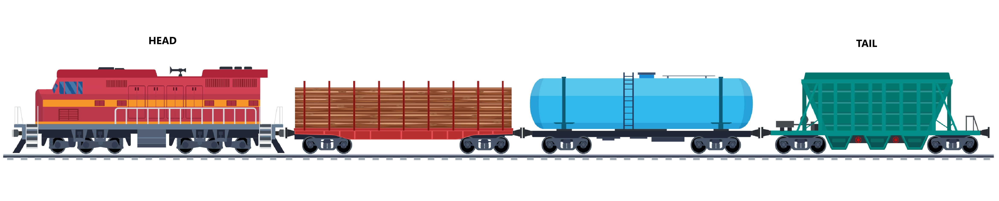
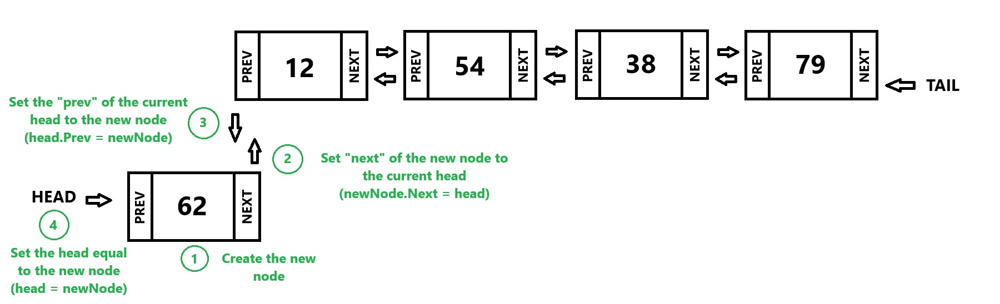
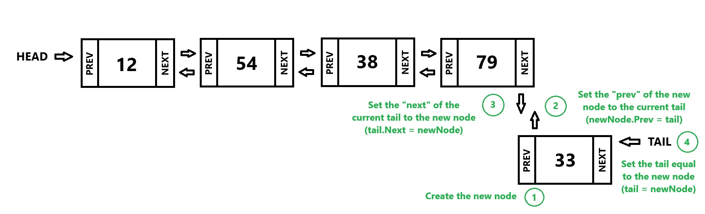
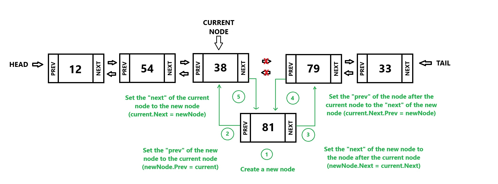
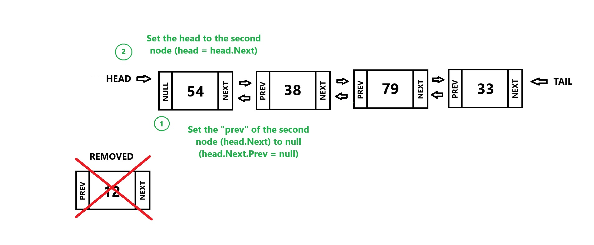
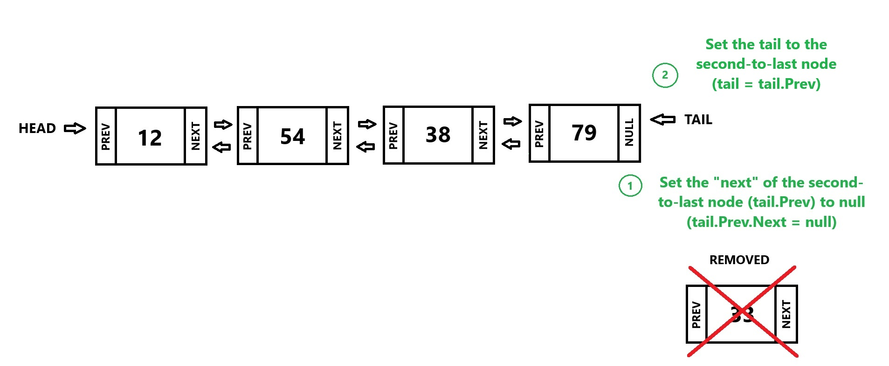
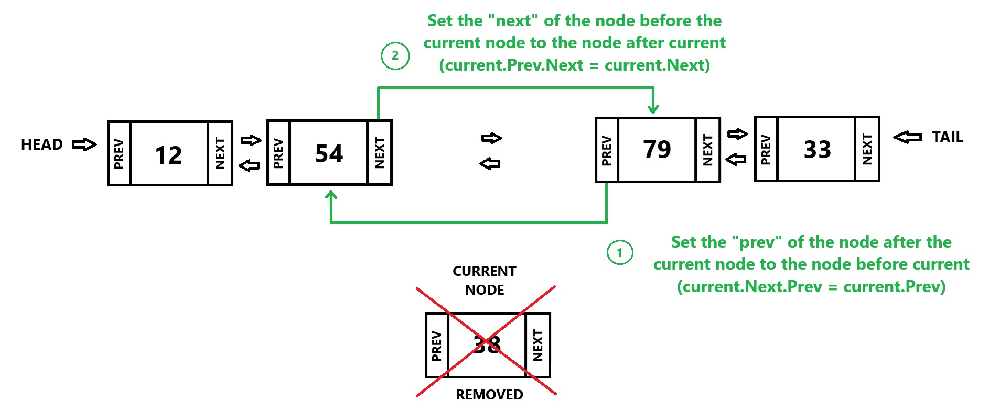

[Back to Welcome Page](/0-welcome.md)
# Linked List
A linked list is a collection of data stored in non-contiguous memory locations. Since the data in a linked list is stored in non-contiguous locations, **pointers** are used to keep track of the list. Each element in a linked list is called a **node**, and each node contains both a **value** and a link to the **next** node in the list. This link, or pointer, indicates the location of the next node. The pointer allows the list to maintain its sequence despite being spread across memory.


In a **doubly-linked list**, each node also contains a **previous** pointer to link to the previous node. The first node in the list is called the **head**, and the last node is called the **tail**, which typically has no next node (or pointer set to null).


<!-- A linked list is similar to a train. The **train cars** represent the **nodes** in a linked list, and each train car (node) contains **materials (data)** like liquid nitrogen, gas, lumber, coal, or, in a passenger train, people. Each car has a **coupling (pointer)** that connects it to the next train car. The **engine (head)** is the first car in the train, and the **last car (tail)** does not have a coupling to the next car, just like the last node in a linked list points to null or nothing. 

 -->
Imagine a mother who needs to do a bunch of shopping and she has several stores on her list that she plans to visit, including the grocery store, Nordstroms, Walmart and Best Buy. 

Grocery store &rarr; Nordstroms &rarr; Walmart &rarr; Best Buy

Each store is like a **node** in a linked list. At each store she collects all the items she needs for that location and the item or items are like the **value** of the node. The first store (e.g. the grocery store) is the **head** of the trip, it is where she starts. When she finishes shopping at the **current** store she knows where to go next based on her plan, which is like the **next** pointer. 

If she realizes she forgot something she can revisit a previous store. This ability to revisit a store is like the **previous** pointer in a doubly-linked list. If she remembers she also needs supplies from the pharmacy (a store not originally planned), she can add it to her trip. This is like **inserting** a new node in the linked list. If she decides she doesn’t need anything from Walmart, she can go straight to the next store. This is like **removing** a node from the list.


## Linked List Terminology
- **Linked list** - a data structure that keeps data in order but is not in contiguous memory. To get to the next (or previous) item in the list, pointers are used.
- **Value** - the actual data stored in each node of the linked list.  
- **Pointer** - a variable that points to the address or location in memory of an object. It is used to link nodes in a linked list and is also called a reference.  
- **Node** - an item in a linked list containing a value (data) and a reference (pointer) to the next node. Doubly-linked lists also contain a reference to the previous node.  
- **Head** - a pointer to the first node in a linked list.  
- **Tail** - a pointer to the last node in a linked list. If the list has only one item, then the head and tail are the same.  
- **Next** - a pointer in each node of the linked list that points to the next node.  
- **Prev** - a pointer in each node of the linked list that points to the previous node.  
- **Doubly-linked list** - a bidirectional linked list with both a head and a tail. Each node has pointers to both the next and previous nodes, allowing traversal in either direction (forward or backward).<br><br>

## Operations & Performance

| Operation           | Description                                           | C# Code                                | Performance |
|---------------------|-------------------------------------------------------|----------------------------------------|-------------|
| InsertHead(value)   | Adds a "value"  before the head.                      | linkedlist_name.AddFirst(value);       | O(1)        |
| InsertTail(value)   | Adds a "value" after the tail.                        | linkedlist_name.AddLast(value);        | O(1)        |
| Insert(node, value) | Adds a "value" after node "node".                     | linkedlist_name.AddAfter(node, value); | O(n)        |
| RemoveHead()        | Removes the first item (the head).                    | linkedlist_name.RemoveFirst();         | O(1)        |
| RemoveTail()        | Removes the last item (the tail).                     | linkedlist_name.RemoveLast();          | O(1)        |
| Remove(node)        | Removes node "node".                                  | linkedlist_name.Remove(node);          | O(n)        |
| Size()              | Return the size of the linked list.                   | linkedlist_name.Count                  | O(1)        |
| empty()             | Returns true if the  size of the linked list is  zero | linkedlist_name.Count == 0             | O(1)        |

### Adding to a Doubly-Linked List
Because data is stored in non-contiguous memory locations, the act of inserting or adding to a linked list only has an effect on the neighboring elements, so we don't have to worry about moving items like in a dynamic array, we just have to set the pointers. When adding to a linked list we can add to the front or head, we can add or insert in the middle or we can add or insert at the back or tail. A special case exists for inserting at the head or tail of an empty linked list (head == null). When inserting into an empty list, the new node becomes both the head and the tail, as it is the only node in the list. Therefore, we can set both head and tail to the new node.

#### Inserting at the Head
1. Create a new node (newNode)
2. Set the “next” of the new node to the current head (newNode.Next = head)
3. Set the “prev” of the current head to the new node (head.Prev = newNode)
4. Set the head equal to the new node (head = newNode)



#### Inserting at the Tail
1. Create a new node (newNode)
2. Set the "prev" of the new node to the current tail (newNode.Prev = tail)
3. Set the "next" of the current tail to the new node (tail.Next = newNode)
4. Set the tail equal to the new node (tail = newNode)



#### Inserting in the middle
In this example we are inserting after the **current** node in the middle.
1. Create a new node (newNode)
2. Set the "prev" of the new node to the current node (newNode.Prev = current)
3. Set the "next" of the new node to the next node after the current node (newNode.Next = current.Next)
4. Set the "prev" of the node after the current node to the "next" of the new node (current.Next.Prev = newNode)
5. Set the "next" of the current node to the new node (current.Next = newNode)

<br><br>

### Removing from a Doubly-Linked List
If there is only one node in the linked list and that node is removed, both the head and tail should be set to **null**, effectively making the list empty. Removing the first node (head) involves updating the head to point to the second node, or setting it to null if no nodes remain.Removing the last node (tail) requires updating the **next** pointer of the second-to-last node to null and setting the second-to-last node as the new tail. 

#### Removing the first node (Head)
1. Set the “prev” of the second node (head.Next) to null (head.Next.Prev = null)
2. Set the head to be the second node (head = head.Next)

 

#### Removing the last node (Tail)
1. Set the “next” of the second to last node (tail.Prev) to null (tail.Prev.Next = null)
2. Set the tail to be the second to last node (tail = tail.Prev)



#### Removing from the middle
In this example we are removing the **current** node from the middle
1. Set the "prev" of the node after the current node to the node before current (current.Next.Prev = current.Prev)
2. Set the next of the node before current to the node after current (current.Prev.Next = current.Next)




## Types of Linked Lists
- Singly Linked List:<br>
 Grocery store &rarr; Nordstroms &rarr; Walmart &rarr; Best Buy

- Doubly Linked List:<br>
Grocery store &harr; Nordstroms &harr; Walmart &harr; Best Buy

- Circular Linked List:<br>
Grocery store &rarr; Nordstroms &rarr; Walmart &rarr; Best Buy &rarr; Grocery store &rarr; Nordstroms


## Applications of Linked List
### Real-World Applications:
- Navigation systems
- Music or video playlists
- Undo/Redo functionality in software
- Navigation in a web browser's history
- Scheduling and task management systems

### Programming Applications:
- Implementing stacks, queues, and hash tables.
- Efficiently managing memory for dynamic data.
- Handling situations where memory fragmentation is common.
- Graph representations (e.g., adjacency list for graphs, efficient edge storage).
- Memory management (e.g., allocating and freeing memory blocks in operating systems).

## Code Example/Implementation
### Program Class
```csharp
using System;
using System.Collections.Generic;

class Program
{
    static void Main(string[] args)
    {
        // Create a new doubly-linked list
        LinkedList<int> linkedList = new LinkedList<int>();

        // InsertHead(value): Adds a value before the head
        linkedList.AddFirst(2);
        Console.WriteLine("After InsertHead operations:");
        PrintList(linkedList); // List: 2 -> null

        linkedList.AddFirst(1); // Adds a value before the head
        Console.WriteLine("After InsertHead operations:");
        PrintList(linkedList); // List: 1 -> 2 -> null

        // InsertTail(value): Adds a value after the tail
        linkedList.AddLast(4);
        linkedList.AddLast(5); // List: 1 -> 2 -> 4 -> 5 -> null
        Console.WriteLine("After InsertTail operations:");
        PrintList(linkedList);

        // Insert(node, value): Adds a value after a specific node
        var node = linkedList.Find(2); // Find the node containing 2
        if (node != null)
        {
            linkedList.AddAfter(node, 3); // Add a node with value 3 after node with value 2
        }

        Console.WriteLine("After Insert operations:");
        PrintList(linkedList); // List: 1 -> 2 -> 3 -> 4 -> 5 -> null

        // RemoveHead(): Removes the first item (the head)
        linkedList.RemoveFirst();
        Console.WriteLine("After RemoveHead operation:");
        PrintList(linkedList); // List: 2 -> 3 -> 4 -> 5

        // RemoveTail(): Removes the last item (the tail)
        linkedList.RemoveLast();
        Console.WriteLine("After RemoveTail operation:");
        PrintList(linkedList); // List: 2 -> 3 -> 4

        // Remove(node): Removes a specific node
        var nodeToRemove = linkedList.Find(3);
        if (nodeToRemove != null)
        {
            linkedList.Remove(nodeToRemove);
        }

        Console.WriteLine("After Remove operation:");
        PrintList(linkedList); // List: 2 -> 4

        // Size(): Returns the size of the linked list
        Console.WriteLine($"Size of the linked list: {linkedList.Count}"); // Size is 2
    }

    // Utility method to print the linked list
    static void PrintList(LinkedList<int> linkedList)
    {
        foreach (var item in linkedList)
        {
            Console.Write(item + " -> ");
        }
        Console.WriteLine("null");
    }
}
```
### Output
```
After InsertHead operations:
2 -> null
After InsertHead operations:
1 -> 2 -> null
After InsertTail operations:
1 -> 2 -> 4 -> 5 -> null
After Insert operations:
1 -> 2 -> 3 -> 4 -> 5 -> null
After RemoveHead operation:
2 -> 3 -> 4 -> 5 -> null
After RemoveTail operation:
2 -> 3 -> 4 -> null
After Remove operation:
2 -> 4 -> null
Size of the linked list: 2
```

## Example Problem: Music Playlist
In the example below we will write a program to create a music playlist using a doubly linked list data structure to mimic the functionality of a media player. The playlist consists of nodes, where each node represents a song, containing information such as the song's title, artist, and pointers to the next and previous songs. The system allows users to dynamically manage and navigate through the playlist with commands like playing the current song, skipping to the next song, or returning to the previous song.

Music Playlist Key Components:
- User needs to be able to add songs to the playlist.
- User should be able to move to the next song or previous song.
- User needs to be able to play the current song.
- User should be able to view the entire playlist to know what songs are next or previous.
- SongNode class represents an individual song in the playlist. It uses properties to store the song's details and pointers (`Next` and `Previous`) to other songs.
- Playlist class manages the playlist by handling operations such as adding songs, navigating through songs and displaying the playlist.


<br>

<details>
    <summary><strong>Show Example Code</strong></summary>

### Program Class
```csharp
using System;
using System.Collections.Generic;

class Program
{
    static void Main(string[] args)
    {
        // Initial list of songs
        var availableSongs = new List<(string Title, string Artist)>
        {
            ("Shape of You", "Ed Sheeran"),
            ("Blinding Lights", "The Weeknd"),
            ("Rolling in the Deep", "Adele"),
            ("Bohemian Rhapsody", "Queen"),
            ("Smells Like Teen Spirit", "Nirvana"),
            ("Uptown Funk", "Mark Ronson ft. Bruno Mars"),
            ("Hotel California", "Eagles"),
            ("Billie Jean", "Michael Jackson"),
            ("Imagine", "John Lennon"),
            ("Someone Like You", "Adele"),
            ("Shake It Off", "Taylor Swift"),
            ("Stairway to Heaven", "Led Zeppelin"),
            ("Despacito", "Luis Fonsi ft. Daddy Yankee"),
            ("Thinking Out Loud", "Ed Sheeran"),
            ("Sweet Child O' Mine", "Guns N' Roses"),
            ("Hello", "Adele"),
            ("Bad Guy", "Billie Eilish"),
            ("Old Town Road", "Lil Nas X"),
            ("Havana", "Camila Cabello"),
            ("Let It Be", "The Beatles"),
            ("Wonderwall", "Oasis"),
            ("Hey Jude", "The Beatles"),
            ("Shake It Off", "Taylor Swift"),
            ("Thriller", "Michael Jackson"),
            ("Rolling in the Deep", "Adele"),
            ("Radioactive", "Imagine Dragons"),
            ("Firework", "Katy Perry"),
            ("Born to Run", "Bruce Springsteen"),
            ("Yesterday", "The Beatles"),
            ("Roar", "Katy Perry"),
            ("Happy", "Pharrell Williams"),
            ("Closer", "The Chainsmokers"),
            ("Believer", "Imagine Dragons"),
            ("Toxic", "Britney Spears"),
            ("Livin' on a Prayer", "Bon Jovi")
        };

        Playlist playlist = new Playlist();

        Console.WriteLine("Available Songs:");
        for (int i = 0; i < availableSongs.Count; i++)
        {
            Console.WriteLine($"{i + 1}. {availableSongs[i].Title} by {availableSongs[i].Artist}");
        }

        // Let the user add songs to the playlist
        Console.WriteLine("\nEnter the numbers of the songs to add to the playlist (comma-separated):");
        var input = Console.ReadLine()?.Trim();
        if (!string.IsNullOrWhiteSpace(input))
        {
            var selectedIndices = input.Split(',');

            foreach (var indexStr in selectedIndices)
            {
                if (int.TryParse(indexStr.Trim(), out int index) && index > 0 && index <= availableSongs.Count)
                {
                    var song = availableSongs[index - 1];
                    playlist.AddSong(song.Title, song.Artist);
                }
            }
        }

        // Main playback loop
        string? command;
        do
        {
            Console.WriteLine("\nCommands: pl(a)y | (n)ext | (p)revious | (l)ist | (q)uit");
            Console.Write("Enter a command: ");
            command = Console.ReadLine()?.Trim().ToLower();

            switch (command)
            {
                case "a": // play
                    playlist.DisplayCurrentSong();
                    break;
                case "n": // next
                    playlist.NextSong();
                    break;
                case "p": // previous
                    playlist.PreviousSong();
                    break;
                case "l": // list
                    playlist.DisplayPlaylist();
                    break;
                case "q": // quit
                    Console.WriteLine("Exiting...");
                    break;
                default:
                    Console.WriteLine("Invalid command. Try again.");
                    break;
            }
        } while (command != "q");
    }
}
```

### SongNode Class
```csharp
class SongNode
{
    public string Title { get; set; }
    public string Artist { get; set; }
    public SongNode? Next { get; set; }
    public SongNode? Previous { get; set; }

    public SongNode(string title, string artist)
    {
        Title = title;
        Artist = artist;
        Next = null;
        Previous = null;
    }
}
```

### PlayList Class
```csharp
class Playlist
{
    private SongNode? head;
    private SongNode? current;

    // Add a song to the end of the playlist
    public void AddSong(string title, string artist)
    {
        var newSong = new SongNode(title, artist);
        if (head == null)
        {
            head = newSong;
            current = head;
        }
        else
        {
            SongNode temp = head;
            while (temp.Next != null)
            {
                temp = temp.Next;
            }
            temp.Next = newSong;
            newSong.Previous = temp;
        }
    }

    // Display all songs in the playlist
    public void DisplayPlaylist()
    {
        SongNode? temp = head;
        Console.WriteLine("\nCurrent Playlist:");
        if (temp == null)
        {
            Console.WriteLine("The playlist is empty.");
            return;
        }

        while (temp != null)
        {
            Console.WriteLine($"- {temp.Title} by {temp.Artist}");
            temp = temp.Next;
        }
    }

    // Skip to the next song
    public void NextSong()
    {
        if (current != null && current.Next != null)
        {
            current = current.Next;
            Console.WriteLine($"\nNow Playing: {current.Title} by {current.Artist}");
        }
        else
        {
            Console.WriteLine("\nYou are at the end of the playlist.");
        }
    }

    // Go back to the previous song
    public void PreviousSong()
    {
        if (current != null && current.Previous != null)
        {
            current = current.Previous;
            Console.WriteLine($"\nNow Playing: {current.Title} by {current.Artist}");
        }
        else
        {
            Console.WriteLine("\nYou are at the beginning of the playlist.");
        }
    }

    // Display the currently playing song
    public void DisplayCurrentSong()
    {
        if (current != null)
        {
            Console.WriteLine($"\nCurrently Playing: {current.Title} by {current.Artist}");
        }
        else
        {
            Console.WriteLine("\nNo song is currently playing.");
        }
    }
}
```
</details>

## Problem to Solve: To-Do List
The goal of this program is to manage a To-Do List using a doubly linked list data structure. A linked list is an efficient way to dynamically store and manage tasks because it allows tasks to be easily added, removed, and navigated without requiring a fixed block of memory. The program addresses the common requirement of task management systems (i.e. keeping track of tasks, their priorities, due dates, and completion statuses).

This program models the To-Do List as a series of connected task nodes, where each node represents a single task. Each task node contains details such as:

- The task name
- Due date
- Priority (High, Medium, Low)
- Completion status

To achieve this, a doubly linked list is used, allowing traversal in both directions (from head to tail and vice versa). This design enables efficient addition, removal, and updates of tasks in the list.

To-Do List Key Components:
1. **Dynamic Task Management:**
    - Users should be able to add new tasks to the list.
    - Users should be able to remove tasks by specifying the task name.
    - Users should be able to mark tasks as completed.

2. **Task Priorities and Due Dates:**
    - Each task has an associated priority (`High`, `Medium`, or `Low`).
    - A due date is assigned to every task to help users organize their list.

3. **Completion Status:**
    - Each task has a completion status that can be toggled between:
        - `Completed: [x]` for completed tasks.
        - `Completed: []` for incomplete tasks.

4. **Efficient Traversal:**
    - The doubly linked list allows the program to traverse through tasks efficiently, making it possible to perform operations like displaying all tasks or removing a specific task.

5. **Error Handling:**
    - The program checks for null values when traversing the list or updating tasks to avoid runtime errors.
    - Informative messages are displayed when an operation cannot be performed, such as when trying to remove a task that does not exist.

6. **User Interaction:**
    - A simple console interface is provided, allowing users to interact with the program by selecting options from a menu.

### Key Features to Consider When Writing the Code:

#### Doubly Linked List Implementation:
- Each task node contains references to the **next** and **previous** nodes, enabling traversal in both directions.
- These references (`Next` and `Previous`) must be carefully managed when adding or removing nodes to maintain the integrity of the list.

#### Null Handling:
- Since the list is dynamic, the `Next` and `Previous` pointers in each node can sometimes be `null`, especially for the **head** and **tail** nodes.
- The program must check for `null` values during operations like removal or traversal to prevent errors.

#### Priority Representation:
- Priority is stored as an integer (`1 = High`, `2 = Medium`, `3 = Low`) but is displayed as a user-friendly string during task output.

#### Separation of Responsibilities:
- The **TaskNode** class is responsible for representing individual tasks.
- The **ToDoList** class handles list operations like adding, removing, updating, and displaying tasks.

#### User-Friendly Output:
- Each task's details are displayed in a readable format, including the **task name**, **due date**, **priority**, and **completion status**.

#### Scalability:
- The linked list implementation allows the program to handle a large number of tasks without the need for resizing or significant memory overhead.

### Example Output
```
To-Do List Management
Choose an option:
1. Add a task
2. Remove a task
3. Mark a task as completed
4. Display all tasks
5. Exit
Enter your choice: 4

To-Do List:


To-Do List Management
Choose an option:
1. Add a task
2. Remove a task
3. Mark a task as completed
4. Display all tasks
5. Exit
Enter your choice: 1
Enter task name: Buy groceries
Enter due date (yyyy-mm-dd): 2024-12-9
Enter priority (1 = high, 2 = medium, 3 = low): 
1

To-Do List Management
Choose an option:
1. Add a task
2. Remove a task
3. Mark a task as completed
4. Display all tasks
5. Exit
Enter your choice: 4

To-Do List:
Task: Buy groceries, Due: 12/9/2024, Priority: High, Completed: []


To-Do List Management
Choose an option:
1. Add a task
2. Remove a task
3. Mark a task as completed
4. Display all tasks
5. Exit
Enter your choice: 3
Enter task name to mark as completed: Buy groceries
Task 'Buy groceries' marked as completed.


To-Do List Management
Choose an option:
1. Add a task
2. Remove a task
3. Mark a task as completed
4. Display all tasks
5. Exit
Enter your choice: 4

To-Do List:
Task: Buy groceries, Due: 12/9/2024, Priority: High, Completed: [x]


To-Do List Management
Choose an option:
1. Add a task
2. Remove a task
3. Mark a task as completed
4. Display all tasks
5. Exit
Enter your choice: 2
Enter task name to remove: Buy groceries
Task 'Buy groceries' removed.


To-Do List Management
Choose an option:
1. Add a task
2. Remove a task
3. Mark a task as completed
4. Display all tasks
5. Exit
Enter your choice: 4

To-Do List:

```
<br>

You can check your code with the solution here: [Solution](ds2-solution)

[Back to Welcome Page](/0-welcome.md)