[Back to Welcome Page](/0-welcome.md)
# Trees

Trees are similar to linked lists in that they are made up of **nodes**, however unlike linked lists, where each node connects to only one other node, a tree node can connect to multiple nodes. The topmost node of a tree is called the **root** node, and there is always only one root node. Nodes are connected by **edges** which represent their relationships. Trees are hierarchical data structures. A node that has other nodes connected to it is called a **parent** node. The nodes connected to the parent node are called **child** nodes. Nodes that have no other nodes connected to them are called **leaf** nodes. The nodes to the left and right of any parent node form a **subtree**. There are three main types of trees:

- **Binary Tree**
- **Binary Search Tree (BST)**
- **Balanced Binary Search Tree (BBST)**

In the tree below, we see that A is the root node and B and C are parent nodes, because they have children under them. The children of node B are nodes D and E and the children or node C are nodes F and G. Nodes F and G are siblings, and nodes D and E are also siblings. Node D is also the parent node of nodes H and I and node G is also a parent node to node J. Nodes H, I and J are all leaves, meaning they have no other nodes (children) connected to them. Nodes B, D, E, H and I also represent a subtree, meaning a tree within a tree. The height of a tree is defined by the length of the longest path (in terms of edges) from the root node to any leaf node in the tree. Edges are represented by the lines connecting nodes, for example:<br>
- ```A → C → G → J``` (3 edges, longest path)
- Height of the tree = 3 (from root A to leaf J)<br><br>

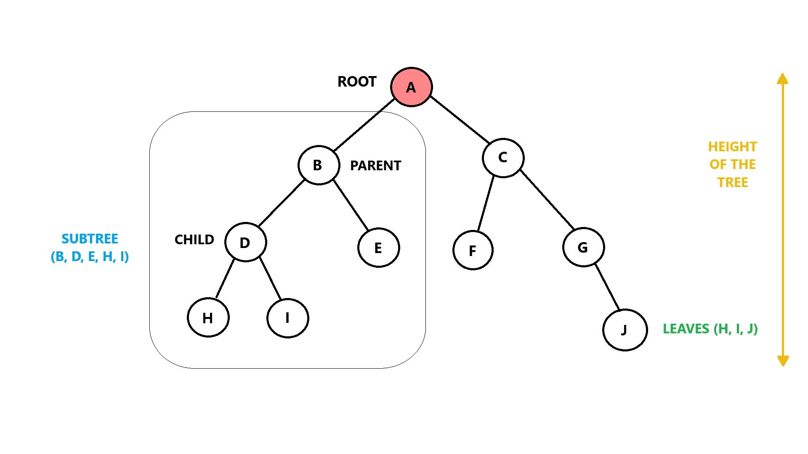

---

## Trees Terminology
- **Node** - an individual element in a tree containing data and references to child nodes.  
- **Root** - the topmost node in a tree (has no parent).  
- **Parent** - a node with one or more child nodes.  
- **Child** - a node that descends from a parent node.  
- **Leaf** - a node with no other connected nodes (no children).  
- **Edge** - a connection between two nodes (parent and child).  
- **Path** - a sequence of edges connecting two nodes.
- **Traverse** -   The process of visiting all nodes (and subsequently their values) in a tree. In a binary search tree, this is often done using recursion, starting from the smallest value at the leftmost leaf node and moving to the largest value at the rightmost leaf node. 
- **Height of a tree** - the number of edges in the longest path from the root node to a leaf. 
- **Depth of a node** - is the number of edges present in path from the root node of a tree to that node.
- **Height of a node** - is the number of edges present in the longest path connecting that node to a leaf node. 
- **Subtree** - a tree consisting of a node and its descendants.  
- **Degree** - the number of children a node has.  
- **Binary Tree** - a tree where each node has at most two children (left and right).  
- **Binary Search Tree (BST)** - a binary tree where left children are smaller, and right children are larger than the parent.  
- **Balanced Tree** - a tree where the height difference between left and right subtrees is minimized. A tree is balanced if the height of the tree from the root to each leaf is consistent for all subtrees. 
- **Balanced Binary Search Tree** - A binary search tree which is balanced. It has a O(log n) performance when searching.
- **AVL Tree** - a type of self-balancing binary search tree named after its inventors, **Adelson-Velsky** and **Landis**. It ensures that the difference in height (balance factor) between the left and the right subtrees of any node is at most 1. 
- **Red Black Tree** - a self-balancing binary search tree.  
- **Full Tree** - every node has either 0 or the maximum number of children.  
- **Complete Tree** - all levels except possibly the last are fully filled, and nodes are as far left as possible.

---

## Operations & Performance

| Operation        | Description                                                                                  | C# Code                      | Performance                                                                                      |
|------------------|----------------------------------------------------------------------------------------------|------------------------------|--------------------------------------------------------------------------------------------------|
| Insert(value)    | Insert a value into the tree.                                                                | tree_name.Insert(value);     | O(log n) <br>Recursively search the subtrees to find the next available spot. |
| Remove(value)    | Removes a value from the tree.                                                               | tree_name.Remove(value);     | O(log n) <br>Recursively search the subtrees to find the value and then remove it. |
| Contains(value)  | Determine if a value  is in the tree.                                                        | tree_name.Contains(value);   | O(log n) <br>Recursively search the subtrees to find the value. |
| Traverse_Forward | Visit all objects from  smallest to largest.                                                 | tree_name.TraverseForward(); | O(n) <br>Recursively traverse the left subtree and then the right subtree. |
| Traverse_Reverse | Visit all objects from largest to smallest.                                                  | tree_name.TraverseReverse(); | O(n) <br>Recursively traverse the right subtree and then the left subtree. |
| Height(node)     | Determine the height of a node. If the height of the tree is needed, use the root node.  | tree_name.Height(node);      | O(n) <br>Recursively find the height of the left and right subtrees and return the maximum height. |
| Size()           | Return the size of the tree.                                                                 | tree_name.Size();            | O(1) <br>The size is maintained within the tree class. |
| Empty()          | Returns true if the tree is empty (i.e., the root node is null or size is 0).                                                     | tree_name.Empty();           | O(1) <br>The comparison of the root node or checking size for 0. |

<br><br>


## Binary Trees
Below is an example of a **Binary Tree**. The nodes are not arranged in any specific order and node value is not used when placing nodes. When adding a node, we simply search for the leftmost empty position in the tree to place it. If there is already a node in the leftmost position the new node is added to the right. 

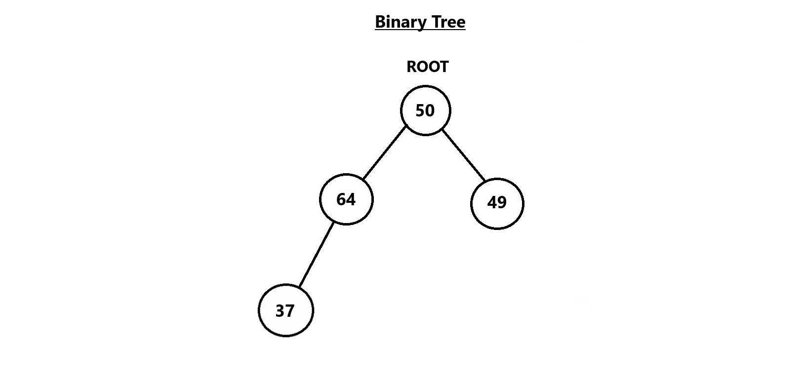


### Traversal in a Binary Tree
Traversal in a binary tree refers to the process of visiting and accessing all the nodes in the tree in a specific order. There are two main types of tree traversal algorithms: **Depth-First Search (DFS)** and **Breadth-First Search (BFS)**.

1. **Depth-First Search (DFS)**:  
   DFS explores a tree by going as far down a branch as possible before backtracking to explore other branches. This is usually implemented using recursion. The three primary traversal methods in DFS for binary trees are:
   
   - **Preorder Traversal (root → left → right)**:  
     First, visit the root node, then visit the left subtree, and finally visit the right subtree. This method processes the node before its children.
   
   - **Inorder Traversal (left → root → right)**:  
     First, visit the left subtree, then visit the current node, and finally visit the right subtree. In a binary search tree, this traversal produces the nodes in ascending order.
   
   - **Postorder Traversal (left → right → root)**:  
     First, visit the left subtree, then the right subtree, and finally visit the current node. This method processes the node after its children.

2. **Breadth-First Search (BFS)**:  
   BFS explores all the nodes at the current level (or depth) before moving on to the next level. It is typically implemented using a queue. In the context of binary trees, BFS is also known as **Level Order Traversal**. This method starts at the root and visits all nodes level by level, from left to right, before moving deeper into the tree.

### Searching in a Binary Tree

Searching for a value in a binary tree involves traversing the tree to locate a node that contains the desired value. Unlike binary search trees, binary trees do not follow a specific ordering rule, so we rely on traversal methods to search for a value. The most common methods for searching are **Depth-First Search (DFS)** and **Breadth-First Search (BFS)**.

- **DFS Search**:  
   Starting from the root, DFS explores as far down the tree as possible before backtracking. This allows for a thorough search of each branch.
   
- **BFS Search**:  
   In BFS, we start at the root and search all nodes at the current depth level before moving on to nodes at the next level.

Both methods continue until either the desired node is found, or we reach the end of the tree. If the tree is empty, or if after fully exploring the tree no node with the desired value is found, we conclude that the value does not exist in the tree.

#### Additional Clarification and Details:

- **Traversal vs. Searching**: Traversal is the process of visiting all nodes in the tree in a specific order, while searching is specifically looking for a particular node that matches a value. Though traversal methods are used in searching, the primary goal of searching is to find a target value, whereas traversal is about visiting nodes in an organized manner.
  
- **Recursive Nature**: Both DFS and BFS methods can be implemented either recursively (DFS is commonly recursive) or iteratively. Recursion simplifies the code, especially for DFS, but iteration (with a stack or queue) is often used for BFS to avoid potential stack overflow issues in large trees.

---

### Insertion in a Binary Tree
Inserting elements in a binary tree, means adding a new node. When adding the new node, we simply search for an empty place at each level of the tree. Once we find an empty left or right child the new node is inserted there. By convention, ***insertion always starts with the left child node***. For example, starting with the root node 50, which has two children (64 and 49), we check the left child 64. Since 64 already has a left child (37), 21 is placed as the right child of 64.

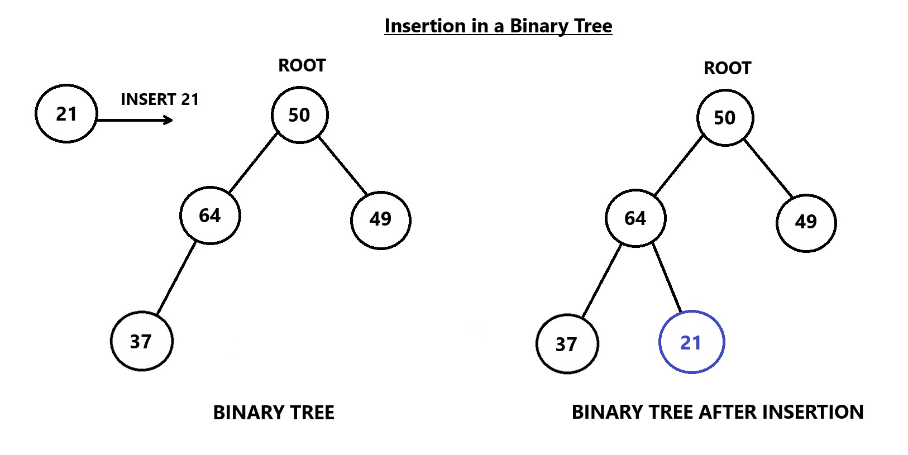

---

### Deletion in a Binary Tree
To delete a node from a binary tree, we remove the specific node while preserving the tree's structure. First, find the node to delete using any traversal method. In the example below, the node to delete is 64. Then, ***replace the node’s value with the value of the rightmost leaf***. In this case, the rightmost leaf is 21, so we replace 64 with 21 and then delete the leaf node where 21 was. This ensures the tree's structure remains intact. It is important to always consider special cases, such as trying to delete from an empty tree, to avoid errors.

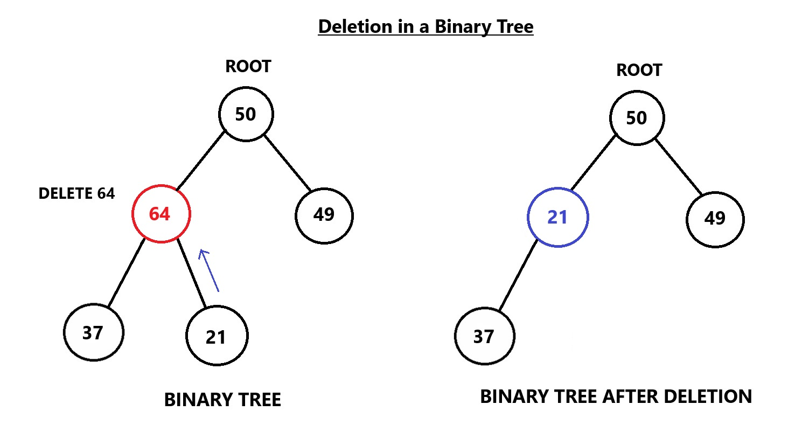

---

## Binary Search Trees
**Binary Search Trees (BSTs)** are similar to binary trees in that they share many of the same parts, but the ***key difference lies in how the data is organized***. In a BST, data is placed by comparing it with the value in the parent node. If the data value is **less than** the parent node's value, it is placed to the **left**; if the data value is **greater than** the parent node's value, it is placed to the **right**. If duplicates are allowed, **duplicates** can be placed **either** to the left or the right of the node, depending on the implementation. This ordering ensures that the data remains organized and sorted within the tree. Thus, a binary search tree (BST) is a binary tree where every node in the left subtree has a value less than the root node, and every node in the right subtree has a value greater than the root node. The properties of a binary search tree are recursive: if we take any node as a "root," these properties will remain true.

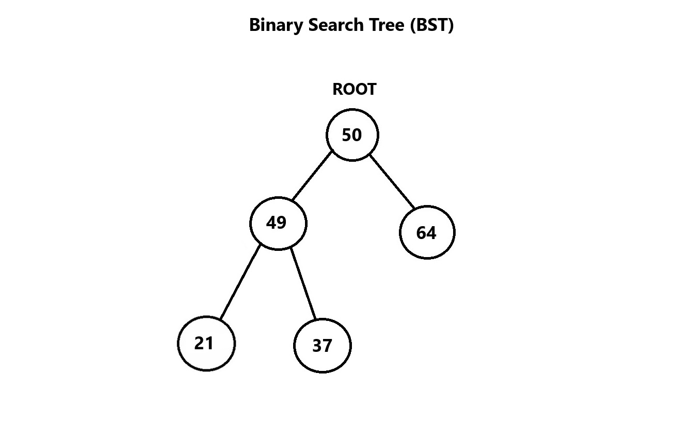

In the following Binary Search Tree, 23 is the data value in the root node, and 18 is less than 23, so it is placed in the left node. The number 46 is greater than 23, so it is placed in the right node. The number 5 is less than 18, so it is placed in the left node and the number 20 is greater than 18, so it is placed in the right node. Finally, 79 is greater than 46, so it is placed in the right node under 46.

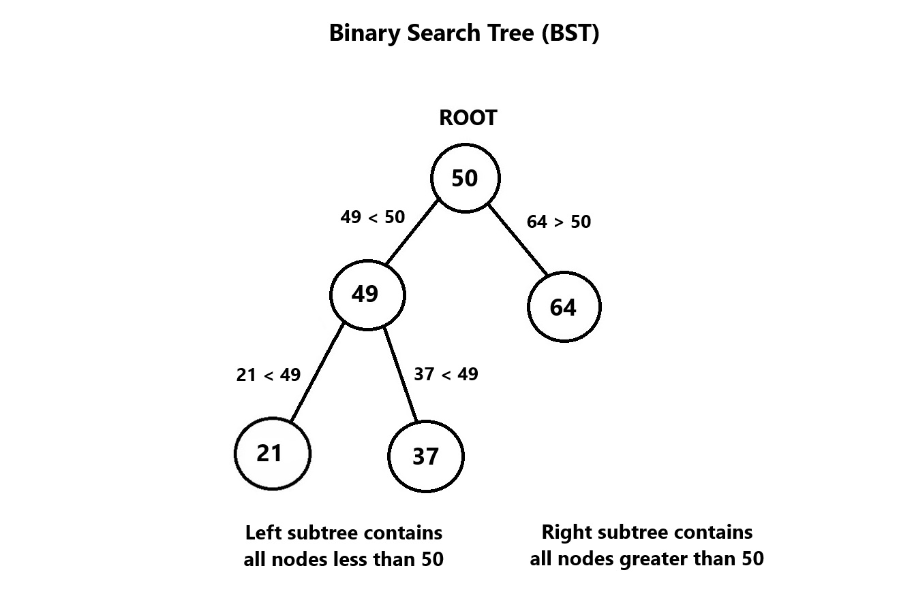

---

### Insertion in a Binary Search Tree
To insert a value into a **binary search tree (BST)**, we follow this rule:
- Values smaller than the parent go to the **left**, and values larger than the parent go to the **right**.  

   This is what distinguishes a **binary search tree** from a **binary tree**.

#### Example: Inserting 42
1. Start at the root (**50**). Since **42 < 50**, move to the left.
2. Compare with **49**. Since **42 < 49**, move to its left child (**21**).
3. Compare with **21**. Since **42 > 21**, move to its right child (**37**).
4. Compare with **37**. Since **42 > 37**, insert **42** as the **right child** of **37**.<br><br>

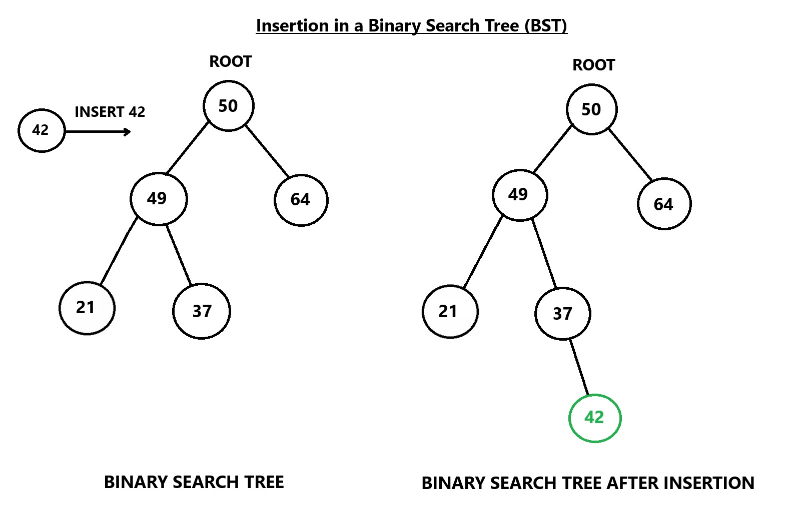

---

### Deletion in a Binary Search Tree
When deleting a node in a BST, the process depends on the number of children the node has. There are three main cases to consider:

#### Case 1: Delete a Leaf Node in a BST
A **leaf node** is a node that has no children.

##### Steps:
1. Simply remove the node from the tree.
2. The parent node will now have no reference to the deleted node, maintaining the BST properties.

##### Explanation:
Deleting a leaf node is the simplest case, as there are no children to worry about. You simply disconnect the node from its parent.

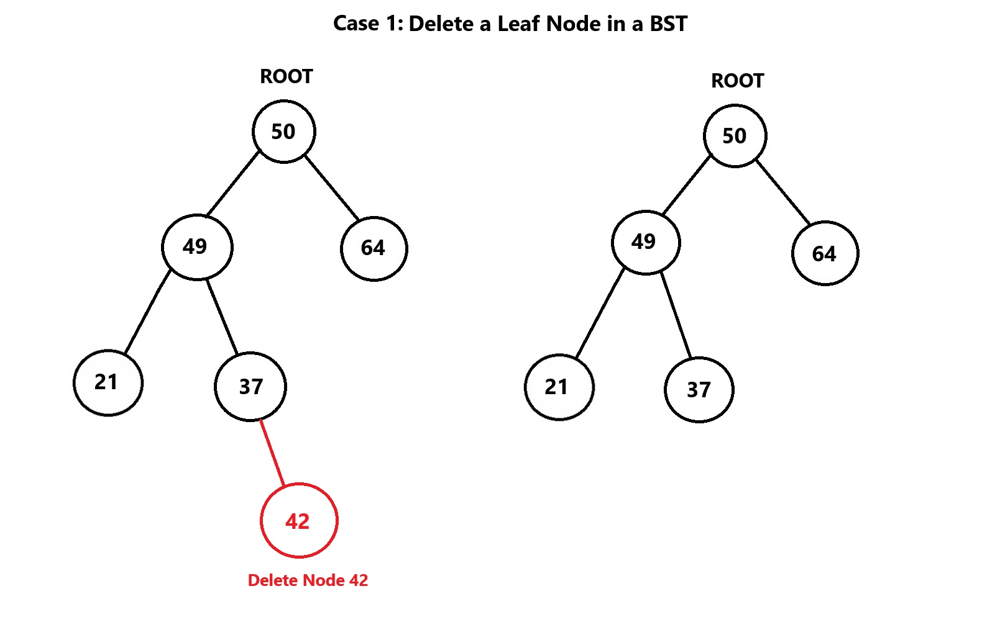

---

#### Case 2: Delete a Node with a Single Child in a BST
When a node has only **one child**, it’s a straightforward deletion process.

##### Steps:
1. Swap the target node (the node being deleted) with its child node.
2. Remove the target node (now a leaf).

##### Explanation:
Since there’s only one child, you can replace the node to be deleted with its child. This ensures that the tree still maintains its binary search tree properties.

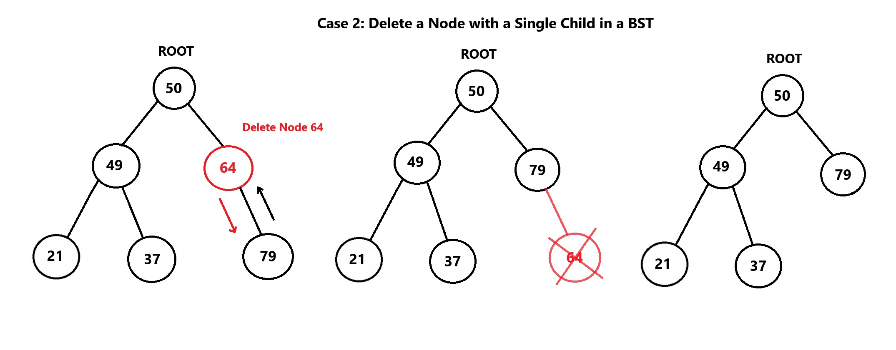

---

#### Case 3: Delete a Node with Both Children in a BST
Deleting a node with **two children** is more complex and requires an additional step to maintain the BST properties.

##### Steps:
1. Find the **In-Order Successor** of the node.  
   - If the node has a **right child**, the in-order successor is the **smallest value** node in the right subtree.
   - Otherwise to find the in-order successor we need to use the in-order traversal method.
2. Replace the value of the inorder successor to the node to be deleted.
3. Delete the inorder successor node, which will either have a single child or be a leaf node.

**In-order traversal** - visits nodes in this sequence:<br>
**left subtree** → **node** → **right subtree**<br>

#### Steps for In Order Successor:
1. **Start at the root (50):** Move to the left subtree starting at **49**.
2. **Leftmost leaf (21):** Visit **21**.
3. **Back to node (49):** Visit **49**.
4. **Move to node (37):** Complete the traversal of the left subtree.
5. **Visit root (50):** Move to the root node.
6. **Right subtree (64):** Traverse the right subtree starting at **64**.
7. **Left child (58):** Visit **58**.
8. **Back to node (64):** Visit **64**.
9. **Final node (79):** Complete the traversal at **79**.

The **In-order Successor (IOS)** of the root node 50 is **58**, as it is the smallest node greater than 50. It is the **successor (next in line)** after 50.

#### In-order traversal result:
```csharp
21, 49, 37, 50, 58, 64, 79
```

### Explanation:
To delete a node with two children, we replace the node with its inorder successor, which is the smallest node in its right subtree. By copying the successor's value to the node being deleted, we maintain the BST structure. The inorder successor is needed only when the right child is not empty. If the right child is empty, the inorder predecessor (the maximum value in the left subtree) can be used instead.

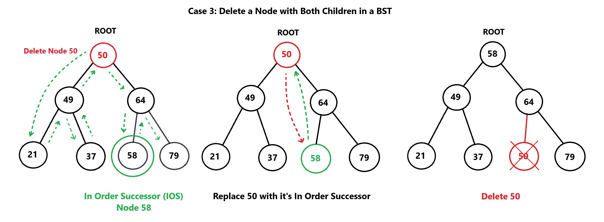

---

### Notes:
- **In-Order Successor** is used when the node to be deleted has a right child, because it ensures the tree BST properties are preserved.
- **In-Order Predecessor** can also be used when there is no right child.

### Height of a Tree
The height of a tree is determined by the number of **edges (connections between nodes)** in the longest path from the root node to a leaf. We use height to determine if a tree is **balanced** or not. A "balanced tree" is a binary tree in which the height difference between the left and right subtrees of any node is at most one. This ensures that no part of the tree is significantly taller than another, resulting in efficient search operations with relatively equal access times to all elements. The difference between the heights of the left subtree and the right subtree for any node is known as the **balance factor** of the node.

***Example 1: The height of the below binary search tree is 2.***
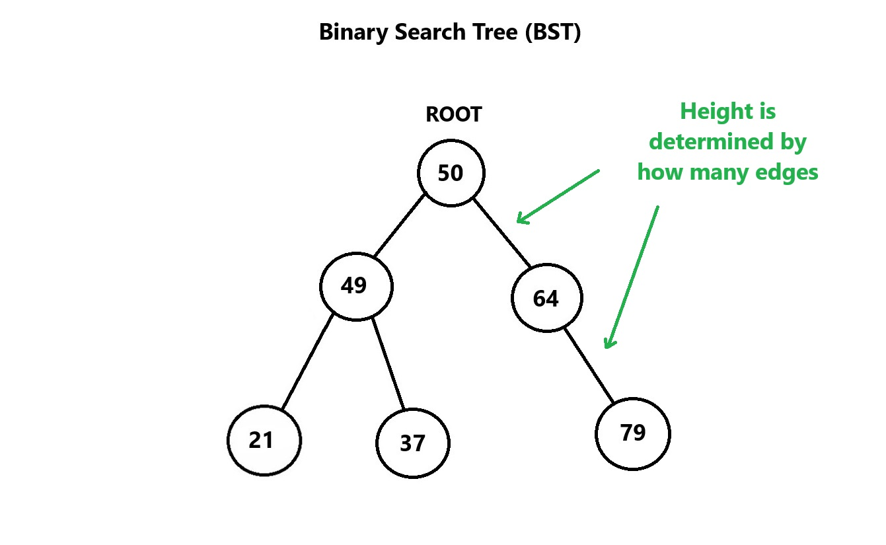

***Example 2: The height of the below binary search tree is 3.***
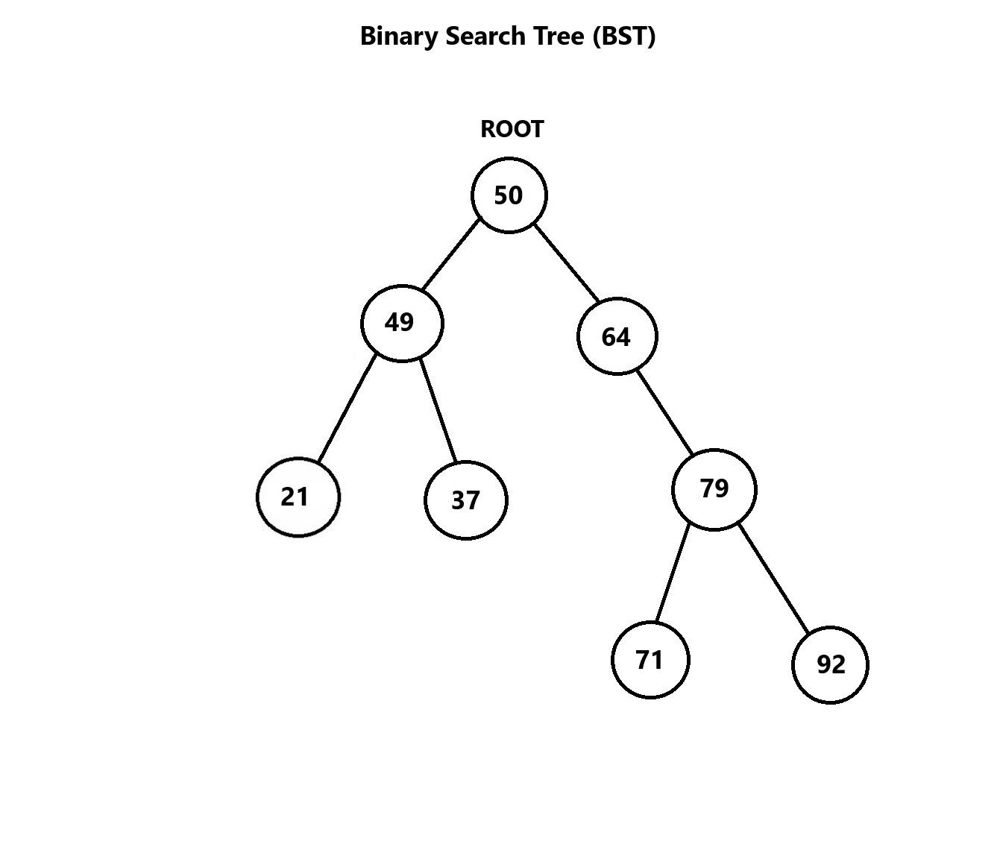

### Unbalanced Binary Search Tree
In the previous binary search tree example our performance is O(log n), this is because our tree is **"balanced"**, however if our root node was the node with the lowest value, instead of 50 and then every node added after that was added in sequential order, our tree would end being unbalanced and it would look like the following:

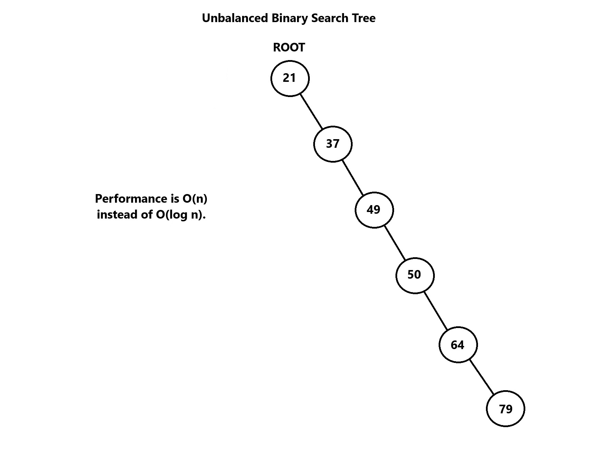

---

## Balanced Binary Search Trees
A balanced binary search tree (BBST) is a binary search tree where the left and right subtrees of every node differ in height by at most one. This ensures the tree performance remains efficient O(log n) for insertion, deletion and search. Since we can't guarantee that the order of the data will result in a balanced BST, there are several algorithms that have been written to detect if a tree is unbalanced and then balance the tree. Common algorithms include **red black trees** and **AVL (Adelson-Velskii and Landis) trees**. In order to balance the tree we have to rotate the nodes to maintain the structure. There are four main types of rotation:

### Left Rotation (Single Rotation)
A **left rotation** is used when the right subtree of a node is taller than the left subtree. It shifts the tree left to balance it.

### Steps:
1. **Identify the node** to rotate (let’s call it `X`).
2. The **right child of `X`** becomes the **new root** of the subtree.
3. **`X` becomes the left child** of its new root.
4. The **left child of the new root** (if it exists) becomes the **right child of `X`**.

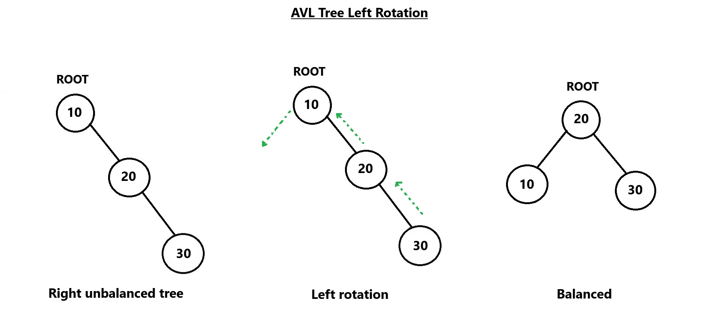


### Right Rotation (Single Rotation)
A **right rotation** is used when the left subtree of a node is taller than the right subtree. It shifts the tree right to balance it.

### Steps:
1. **Identify the node** to rotate (let’s call it `X`).
2. The **left child of `X`** becomes the **new root** of the subtree.
3. **`X` becomes the right child** of its new root.
4. The **right child of the new root** (if it exists) becomes the **left child of `X`**.

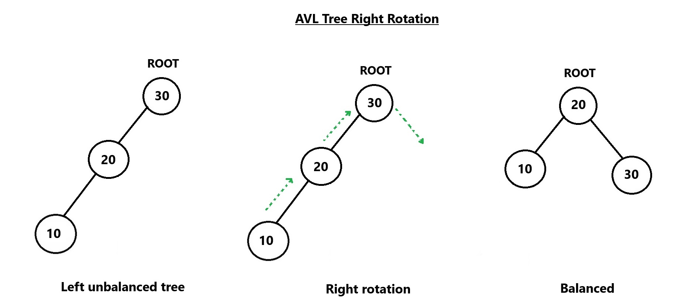


## 3. Left-Right Rotation (Double Rotation)

A **left-right rotation** is a two-step process used when a node’s left child is unbalanced, and the left child’s right subtree is too tall (a right-heavy left child).

### Steps:
1. **Left Rotation** on the **left child** of the unbalanced node.
2. After the left rotation, perform a **Right Rotation** on the original unbalanced node.

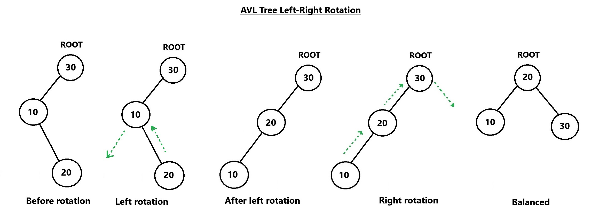


## 4. Right-Left Rotation (Double Rotation)

A **right-left rotation** is a two-step process used when a node’s right child is unbalanced, and the right child’s left subtree is too tall (a left-heavy right child).

### Steps:
1. **Right Rotation** on the **right child** of the unbalanced node.
2. After the right rotation, perform a **Left Rotation** on the original unbalanced node.

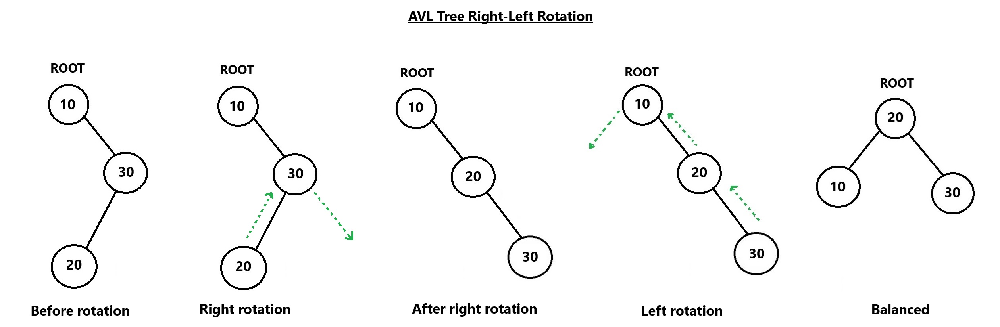


### Summary of Rotation Types:

1. **Left Rotation**: Moves the right child up and makes the current node the left child of the new root.
2. **Right Rotation**: Moves the left child up and makes the current node the right child of the new root.
3. **Left-Right Rotation**: Left rotation on the left child followed by a right rotation on the original node.
4. **Right-Left Rotation**: Right rotation on the right child followed by a left rotation on the original node.

These rotations are essential in keeping the binary search tree balanced, ensuring optimal search time by maintaining a balanced height of subtrees.


## Types of Trees
There are three main types of trees:

- **Binary Trees** - Nodes have up to two children.
- **Binary Search Trees (BST)** - Binary trees with ordered child nodes (left < parent < right).
- **Balanced Binary Search Trees (BBST)** - BSTs optimized to maintain minimal height for efficiency.

## Applications of Trees
### Real-World Applications:
- **Organizational Hierarchies**: Representing company structures, family trees, or any hierarchical relationship.
- **File Systems**: Organizing files and directories in operating systems.
- **Decision Trees**: Used in decision-making processes, such as game strategies or customer service workflows.
- **Taxonomies**: Representing classifications in biology (e.g., species taxonomy) or product categorizations in e-commerce platforms.

### Programming Applications:
- **Parsing Expressions**: Syntax trees in compilers and interpreters for evaluating mathematical or logical expressions.
- **Routing Algorithms**: Tree structures like spanning trees used in network routing protocols (e.g., OSPF).
- **AI and Games**: Game trees for simulating potential moves in chess or tic-tac-toe.
- **Database Indexing**: Hierarchical databases or indexing mechanisms like B-trees or T-trees.


## Applications of Binary Search Trees (BSTs)
### Real-World Applications:
- **Contact Management**: Storing and searching names and numbers in a sorted manner.
- **Library Catalogs**: Organizing books by title, author, or genre for quick lookup.
- **Language Dictionaries**: Searching words and their meanings efficiently.

### Programming Applications:
- **Database Searching**: Implementing indexes for fast retrieval of records.
- **File Access**: Used in operating systems for managing and accessing files efficiently.
- **Autocomplete Systems**: Predicting user input by traversing a BST of stored words or commands.
- **Set and Map Implementations**: Used in languages like Java and C++ for efficient set and map operations.


## Code Example/Implementation

### Program Class
```csharp
using System;
using System.Collections.Generic;

class Program
{
    static void Main()
    {
        var bst = new BinarySearchTree();
        bst.Insert(5); // Root
        bst.Insert(3); // Left child of root
        bst.Insert(7); // Right child of root
        bst.Insert(2); // Left child of node 3
        bst.Insert(4); // Right child of node 3
        bst.Insert(6); // Left child of node 7
        bst.Insert(8); // Right child of node 7
        bst.Insert(1); // Left child of node 2

        Console.WriteLine("Binary Search Tree In-Order Traversal:");
        bst.InOrderTraversal(bst.Root); // Output: 1 2 3 4 5 6 7 8
    }
}
```

### TreeNode Class
```csharp
public class TreeNode
{
    public int Value;
    public TreeNode? Left; 
    public TreeNode? Right; 

    public TreeNode(int value)
    {
        Value = value;
        Left = null;
        Right = null;
    }
}
```

### BinarySearchTree Class
```csharp
public class BinarySearchTree
{
    public TreeNode? Root { get; private set; } = null;

    public void Insert(int value)
    {
        Root = InsertRecursive(Root, value);
    }

    private TreeNode InsertRecursive(TreeNode? node, int value)
    {
        if (node == null)
            return new TreeNode(value);

        if (value < node.Value)
            node.Left = InsertRecursive(node.Left, value);
        else if (value > node.Value)
            node.Right = InsertRecursive(node.Right, value);

        return node;
    }

    public void InOrderTraversal(TreeNode? node)
    {
        if (node != null)
        {
            InOrderTraversal(node.Left);
            Console.Write(node.Value + " ");
            InOrderTraversal(node.Right);
        }
    }
}
```

### Output:
```
Binary Search Tree In-Order Traversal:
1 2 3 4 5 6 7 8
```

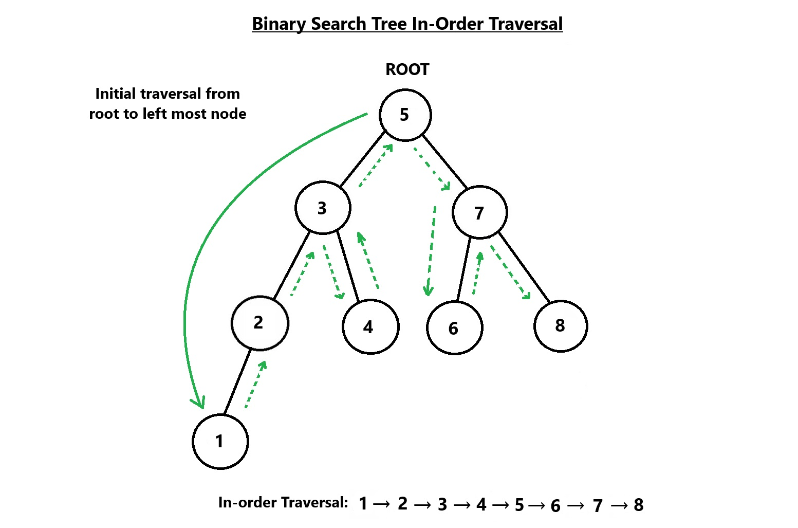


## Example Problem: File Management System
In order to manage files and folders and keep them organized we need some type of file system management software. A file system uses a hierarchy much like a tree, in that there are folders and within those folders there can be files. In this example we will create a program that allows the user to add, remove and move files or folders as well as search for a file. The file structure will be displayed so the user can visualize the hierarchy of files and folders.

File Management System Key Components:
- User needs to be able to add, remove and move files or folders.
- When a folder with files in it is moved the contents move with it.
- The user should be able to see the file system structure each time the menu is displayed so they can see the updates to the file structure as well as file and folder names.
- The user should be able to select an option to exit, otherwise they should be able to continue selecting options from the menu.
- The user should be able to search for a file.
- A tree data structure should be used.

<br>

<details>
    <summary><strong>Show Example Code</strong></summary>

### Program Class
```csharp

using System;
using System.Collections.Generic;

class Program
{
    public static void Main(string[] args)
    {
        FileSystem fileSystem = new FileSystem();  // Create a new FileSystem instance
        fileSystem.Run();  // Run the file system operations
    }
}
```

### FileSystem Class
```csharp
public class FileSystem
{
    // Represents a node (file or folder) in the file system
    private class Node
    {
        public string Name { get; set; }  // Name of the file/folder
        public bool IsFile { get; set; }  // Flag to indicate if the node is a file
        public List<Node> Children { get; } = new();  // List of child nodes (files/folders)
        public Node? Parent { get; set; }  // Parent folder of this node

        // Constructor to create a new node (file/folder)
        public Node(string name, bool isFile)
        {
            Name = name;
            IsFile = isFile;
            Parent = null;  // Initially, the node has no parent
        }
    }

    private readonly Node root;  // The root of the file system (a folder)

    // Constructor to initialize the file system with a root folder
    public FileSystem()
    {
        root = new Node("root", false);  // Root folder (not a file)
    }

    // Runs the program's main logic
    public void Run()
    {
        DisplayFileStructure();  // Show the file structure when the program starts

        while (true)
        {
            DisplayMenu();  // Display the menu options

            // Read user input and validate choice
            if (!int.TryParse(Console.ReadLine(), out int choice) || choice < 1 || choice > 9)
            {
                Console.WriteLine("Invalid choice! Press Enter to try again.");
                Console.ReadLine(); 
                continue;  // Display the menu again
            }

            bool actionSuccessful = false;  // Check if the action was successful

            // Perform the chosen action based on user input
            switch (choice)
            {
                case 1:
                    actionSuccessful = AddFile();
                    break;
                case 2:
                    actionSuccessful = RemoveFile();
                    break;
                case 3:
                    actionSuccessful = MoveFile();
                    break;
                case 4:
                    actionSuccessful = AddFolder();
                    break;
                case 5:
                    actionSuccessful = RemoveFolder();
                    break;
                case 6:
                    actionSuccessful = MoveFolder();
                    break;
                case 7:
                    SearchFile();
                    break;
                case 8:
                    DisplayFileStructure();  // Show file structure when option 8 is selected
                    break;
                case 9:
                    return;  // Exit the program
            }

            // If the action was successful, show the updated file structure
            if (actionSuccessful)
            {
                DisplayFileStructure();  // Update and show the file structure
            }
        }
    }

    // Displays the main menu options
    private static void DisplayMenu()
    {
        Console.WriteLine("\nMenu:");
        Console.WriteLine("1. Add a File");
        Console.WriteLine("2. Remove a File");
        Console.WriteLine("3. Move a File");
        Console.WriteLine("4. Add a Folder");
        Console.WriteLine("5. Remove a Folder");
        Console.WriteLine("6. Move a Folder");
        Console.WriteLine("7. Search for a File");
        Console.WriteLine("8. Display File Structure");
        Console.WriteLine("9. Exit");
        Console.Write("Choose an option: ");
    }

    // Displays the entire file system structure starting from root
    private void DisplayFileStructure()
    {
        Console.WriteLine("\nFile System Structure:");
        DisplayStructure(root, "", true);  // Display the root and its children
    }

    // Recursive function to display a node and its children
    private static void DisplayStructure(Node node, string indent, bool isLast)
    {
        Console.Write(indent);
        if (isLast)
        {
            Console.Write("└── ");  // Draw branch for last child
            indent += "    ";  // Add indentation for the next line
        }
        else
        {
            Console.Write("├── ");  // Draw branch for non-last child
            indent += "|   ";  // Add indentation for the next line
        }
        Console.WriteLine($"{(node.IsFile ? "(File)" : "(Folder)")} {node.Name}");

        // Recursively display all children of the current node
        for (int i = 0; i < node.Children.Count; i++)
        {
            DisplayStructure(node.Children[i], indent, i == node.Children.Count - 1);
        }
    }

    // Adds a new file to the file system
    private bool AddFile()
    {
        Console.Write("Enter file name (with extension i.e. .txt or .jpg): ");
        string? fileName = Console.ReadLine();
        if (string.IsNullOrEmpty(fileName))
        {
            Console.WriteLine("File name cannot be empty.");
            return false;
        }
        return AddNode(fileName, true);  // Add the file node
    }

    // Removes a file from the file system
    private bool RemoveFile()
    {
        Console.Write("Enter file name to remove: ");
        string? fileName = Console.ReadLine();
        if (string.IsNullOrEmpty(fileName))
        {
            Console.WriteLine("File name cannot be empty.");
            return false;
        }
        return RemoveNode(fileName, true);  // Remove the file node
    }

    // Moves a file to a new folder
    private bool MoveFile()
    {
        Console.Write("Enter file name to move: ");
        string? fileName = Console.ReadLine();
        if (string.IsNullOrEmpty(fileName))
        {
            Console.WriteLine("File name cannot be empty.");
            return false;
        }
        return MoveNode(fileName, true);  // Move the file node
    }

    // Adds a new folder to the file system
    private bool AddFolder()
    {
        Console.Write("Enter folder name: ");
        string? folderName = Console.ReadLine();
        if (string.IsNullOrEmpty(folderName))
        {
            Console.WriteLine("Folder name cannot be empty.");
            return false;
        }
        return AddNode(folderName, false);  // Add the folder node
    }

    // Removes a folder from the file system
    private bool RemoveFolder()
    {
        Console.Write("Enter folder name to remove: ");
        string? folderName = Console.ReadLine();
        if (string.IsNullOrEmpty(folderName))
        {
            Console.WriteLine("Folder name cannot be empty.");
            return false;
        }
        return RemoveNode(folderName, false);  // Remove the folder node
    }

    // Moves a folder to a new location
    private bool MoveFolder()
    {
        Console.Write("Enter folder name to move: ");
        string? folderName = Console.ReadLine();
        if (string.IsNullOrEmpty(folderName))
        {
            Console.WriteLine("Folder name cannot be empty.");
            return false;
        }
        return MoveNode(folderName, false);  // Move the folder node
    }

    // Searches for a specific file in the system
    private void SearchFile()
    {
        Console.Write("Enter file name to search: ");
        string? fileName = Console.ReadLine();
        if (string.IsNullOrEmpty(fileName))
        {
            Console.WriteLine("File name cannot be empty.");
            return;
        }

        Node? result = SearchNode(root, fileName, true);  // Search for the file node

        if (result != null)
        {
            Console.WriteLine($"File '{fileName}' found in folder '{result.Parent?.Name ?? "root"}'.");
        }
        else
        {
            Console.WriteLine($"File '{fileName}' not found.");
        }
    }

    // Adds a file or folder to the system under a specified parent
    private bool AddNode(string name, bool isFile)
    {
        Console.Write("Enter parent folder name (i.e. root): ");
        string? parentName = Console.ReadLine();
        if (string.IsNullOrEmpty(parentName))
        {
            Console.WriteLine("Parent name cannot be empty.");
            return false;
        }

        Node? parent = SearchNode(root, parentName, false);  // Find the parent folder
        if (parent == null)
        {
            Console.WriteLine($"Parent folder '{parentName}' does not exist.");
            return false;
        }

        if (parent.IsFile)
        {
            Console.WriteLine("Cannot add a file or folder under another file.");
            return false;
        }

        parent.Children.Add(new Node(name, isFile) { Parent = parent });  // Add new node
        Console.WriteLine($"{(isFile ? "File" : "Folder")} '{name}' added to '{parentName}'.");
        return true;
    }

    // Removes a file or folder from the system
    private bool RemoveNode(string name, bool isFile)
    {
        Node? node = SearchNode(root, name, isFile);

        if (node == null)
        {
            Console.WriteLine($"{(isFile ? "File" : "Folder")} '{name}' not found.");
            return false;
        }

        node.Parent?.Children.Remove(node);  // Remove the node from its parent's children
        Console.WriteLine($"{(isFile ? "File" : "Folder")} '{name}' removed.");
        return true;
    }

    // Moves a file or folder to a different folder
    private bool MoveNode(string name, bool isFile)
    {
        Node? node = SearchNode(root, name, isFile);

        if (node == null)
        {
            Console.WriteLine($"{(isFile ? "File" : "Folder")} '{name}' not found.");
            return false;
        }

        Console.Write("Enter new parent folder name: ");
        string? newParentName = Console.ReadLine();
        if (string.IsNullOrEmpty(newParentName))
        {
            Console.WriteLine("New parent name cannot be empty.");
            return false;
        }

        Node? newParent = SearchNode(root, newParentName, false);  // Find the new parent folder
        if (newParent == null || newParent.IsFile)
        {
            Console.WriteLine($"Invalid parent folder '{newParentName}'.");
            return false;
        }

        node.Parent?.Children.Remove(node);  // Remove node from current parent
        node.Parent = newParent;  // Set the new parent for the node
        newParent.Children.Add(node);  // Add node under the new parent

        Console.WriteLine($"{(isFile ? "File" : "Folder")} '{name}' moved to '{newParentName}'.");
        return true;
    }

    // Searches for a node (file/folder) by name in the file system
    private static Node? SearchNode(Node parent, string name, bool isFile)
    {
        foreach (Node child in parent.Children)
        {
            if (child.Name.Equals(name, StringComparison.OrdinalIgnoreCase) && child.IsFile == isFile)
            {
                return child;  // Found the node with the matching name
            }

            // Recursively search through all children
            Node? found = SearchNode(child, name, isFile);
            if (found != null)
            {
                return found;
            }
        }

        return null;  // Node not found
    }
}
```
</details>

### Example Output:
```
File System Structure:
└── (Folder) root

Menu:
1. Add a File
2. Remove a File
3. Move a File
4. Add a Folder
5. Remove a Folder
6. Move a Folder
7. Search for a File
8. Display File Structure
9. Exit
Choose an option: 4
Enter folder name: shapes
Enter parent folder name (i.e. root): root
Folder 'shapes' added to 'root'.

File System Structure:
└── (Folder) root
    └── (Folder) shapes

Menu:
1. Add a File
2. Remove a File
3. Move a File
4. Add a Folder
5. Remove a Folder
6. Move a Folder
7. Search for a File
8. Display File Structure
9. Exit
Choose an option: 1
Enter file name (with extension i.e. .txt or .jpg): circle.jpg
Enter parent folder name (i.e. root): shapes
File 'circle.jpg' added to 'shapes'.

File System Structure:
└── (Folder) root
    └── (Folder) shapes
        └── (File) circle.jpg

Menu:
1. Add a File
2. Remove a File
3. Move a File
4. Add a Folder
5. Remove a Folder
6. Move a Folder
7. Search for a File
8. Display File Structure
9. Exit
Choose an option: 4
Enter folder name: docs
Enter parent folder name (i.e. root): root
Folder 'docs' added to 'root'.

File System Structure:
└── (Folder) root
    ├── (Folder) shapes
    |   └── (File) circle.jpg
    └── (Folder) docs

Menu:
1. Add a File
2. Remove a File
3. Move a File
4. Add a Folder
5. Remove a Folder
6. Move a Folder
7. Search for a File
8. Display File Structure
9. Exit
Choose an option: 1
Enter file name (with extension i.e. .txt or .jpg): notes.txt
Enter parent folder name (i.e. root): docs
File 'notes.txt' added to 'docs'.

File System Structure:
└── (Folder) root
    ├── (Folder) shapes
    |   └── (File) circle.jpg
    └── (Folder) docs
        └── (File) notes.txt

```

---
<br><br>

## Problem to Solve: Digital Phone Book
You have been tasked with creating a digital phone book program that organizes and manages a directory of contacts. The program should provide the following functionality using using a binary search tree:

### Requirements:
1. **Add a new contact**
    - The user should be prompted to enter the contact's first name, last name, and phone number.
    - The new contact should be stored in a binary search tree (BST), sorted alphabetically by last name. If two contacts share the same last name, use the first name to decide their order.

2. **Search for a contact**
    - The user should be able to search using either the contact last name.
    - If a contact with the entered name exists, their full information (first name, last name, and phone number) should be displayed.
    - If no matching contact is found, display: "Contact not found."

3. **Remove a contact**
    - The user should be prompted to enter the first and last name of the contact they want to remove.
    - If the contact exists, it should be removed from the BST. Ensure that the BST structure is maintained after removal.
    - If no matching contact is found, display: "Contact not found."

4. **Display all contacts**
    - List all contacts in alphabetical order by last name, followed by first name (e.g., using an in-order traversal of the BST).

5. **Exit the program**
    - The user should be able to type 'exit' to exit the program.

---

<details>
    <summary>Click to show hints</summary>

### Instructions

#### 1. Define a `Contact` Class
- Create a class named `Contact` with the following properties:
  - `FirstName`
  - `LastName`
  - `PhoneNumber`
- Override the `ToString` method to format the contact details for display.

#### 2. Create a `ContactBook` Class
- The `ContactBook` class will manage the **binary search tree (BST)**. Implement the following:
  - A private `Node` class to represent each node in the tree.
  - Methods for adding, searching, removing, and displaying contacts:
    - **Add Contact**: Insert a new contact into the BST while maintaining its structure.
    - **Search Contact**: Traverse the BST to locate a contact by last name.
    - **Remove Contact**: Delete a contact from the BST and ensure the BST properties are preserved.
    - **Display Contacts**: Perform an in-order traversal of the BST to list all contacts alphabetically.

#### 3. Implement a Menu System
- Create a menu system to interact with the user. Display the following options:
```csharp
1. Add Contact
2. Search Contact
3. Remove Contact
4. Display All Contacts
5. Exit
```
*You may need additional classes.
</details>

---

### Example Outputs

#### 1. Add a Contact:
```
Contact Management System:
1. Add a Contact
2. Search for a Contact
3. Remove a Contact
4. Display All Contacts
5. Exit
Please choose an option (1-5): 1
Enter the first name of the contact: Jennifer
Enter the last name of the contact: Stevenson
Enter the contact phone number: 854-956-2612
Contact Jennifer Stevenson added successfully.
```

#### 2. Search for a Contact:
```
Contact Management System:
1. Add a Contact
2. Search for a Contact
3. Remove a Contact
4. Display All Contacts
5. Exit
Please choose an option (1-5): 2
Enter the name of the contact to search for: Smith
Found contact: Name: Smith, Michael Phone: 818-823-5672

Contact Management System:
1. Add a Contact
2. Search for a Contact
3. Remove a Contact
4. Display All Contacts
5. Exit
Please choose an option (1-5): 2
Enter the name of the contact to search for: Mark    
Contact not found.

Contact Management System:
1. Add a Contact
2. Search for a Contact
3. Remove a Contact
4. Display All Contacts
5. Exit
Please choose an option (1-5): 2
Enter the name of the contact to search for: Mark Fahlberg
Contact not found.
```

#### 3. Remove a Contact
```
Contact Management System:
1. Add a Contact
2. Search for a Contact
3. Remove a Contact
4. Display All Contacts
5. Exit
Please choose an option (1-5): 3
Enter the first name of the contact to remove: Jennifer 
Enter the last name of the contact to remove: Stevenson
Contact Jennifer Stevenson removed successfully.
```

#### 4. Display All Contacts
```
Contact Management System:
1. Add a Contact
2. Search for a Contact
3. Remove a Contact
4. Display All Contacts
5. Exit
Please choose an option (1-5): 4

All Contacts:
Name: Barker, Bob Phone: 208-546-5678
Name: Brown, Sarah Phone: 510-934-2876
Name: Clark, Linda Phone: 925-156-3842
Name: Doe, John Phone: 213-689-1457
Name: Frost, Robert Phone: 321-515-8757
Name: Hendricks, Marsha Phone: 408-479-3021
Name: Johnson, Alice Phone: 408-712-9835
Name: Long, Leo Phone: 323-356-8974
Name: Martin, April Phone: 415-255-4351
Name: Michaels, Fred Phone: 491-255-4351
Name: Michaels, Fred Phone: 650-589-7365
Name: Simmons, Alice Phone: 958-242-3266
Name: Smith, Michael Phone: 818-823-5672
Name: White, James Phone: 619-045-7983
```

#### 5. Exit
```
Contact Management System:
1. Add a Contact
2. Search for a Contact
3. Remove a Contact
4. Display All Contacts
5. Exit
Please choose an option (1-5): 5
Exiting program...
```

You can check your code with the solution here: [Solution](ds3-solution)

[Back to Welcome Page](/0-welcome.md)